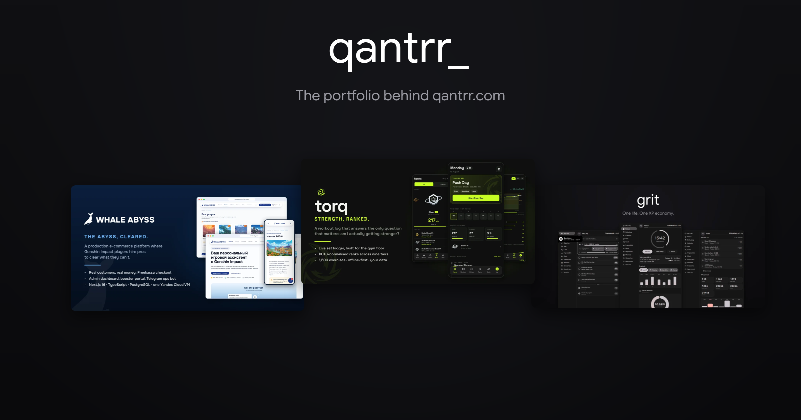

<div align="center">
  
</div>

<div align="center">
  <br/>
  
  
  
  
  
</div>

<br/>

<div align="center">
  <h3>The personal site of <a href="https://github.com/adilzhanY">Adilzhan Yerzhan</a>, live at <a href="https://qantrr.com">qantrr.com</a>.</h3>
  <p>A fast, fully static portfolio: case studies with real numbers, an in-browser
  resume viewer, light and dark themes, and zero servers to wake up.</p>
</div>

---

## What's inside

- **Case-study project pages** for Whale Abyss, Torq, OpenHyprWhisper, and Grit:
  the problem, what was built, highlights, stack, and screenshot galleries,
  all driven by one typed data file (`src/data/cv.ts`).
- **A resume viewer** built on react-pdf: zoom, download, and a circular-reveal
  modal, with the PDF engine lazy-loaded only when opened.
- **Theme switching** with CSS-variable palettes, a no-flash inline script, and
  a View Transitions circular wipe (graceful cross-fade fallback).
- **An experience timeline**, a live GitHub contribution heatmap, verifiable
  certifications, and cookieless visitor counting via GoatCounter.
- **SEO plumbing**: generated `robots.txt` and `sitemap.xml`, Open Graph and
  Twitter cards with a designed preview image.

## Stack

| | |
|---|---|
| **Framework** | Next.js 16 (App Router), React 19, TypeScript |
| **Styling** | Tailwind CSS v4, CSS-variable theming, system font stack |
| **Output** | `output: "export"`: plain static HTML/CSS/JS, no server |
| **Hosting** | Cloudflare Workers static assets, push-to-deploy from `main` |
| **Content** | one source of truth in `src/data/cv.ts` |

## Development

```sh
npm install
npm run dev     # localhost:3000
npm run build   # static site in ./out
```

Every push to `main` builds and deploys automatically via Cloudflare.

## Structure

```text
src/
├── app/            # routes: home, /projects, /projects/[slug], /experience
├── components/     # nav, footer, theme toggle, resume viewer, chips, ...
└── data/cv.ts      # all content: projects, experience, certifications
public/             # images, CV pdf, favicon, og card
wrangler.jsonc      # Cloudflare deploy config
```
